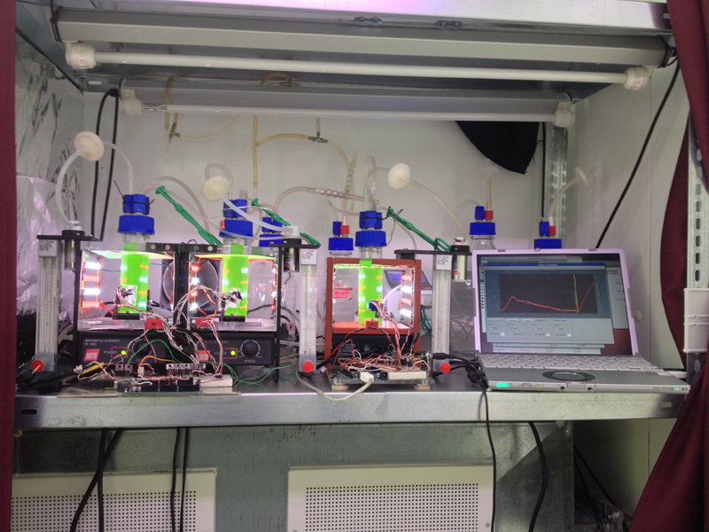

CAPTOR - a Cyanobacterial Arduino-based PhotobioreacTOR
======

The CAPTOR is photobioreactor (PBR) which allows monitoring growth of a cyanobacterial liquid clulture. It uses an Arduino Uno (R3) microcontroller as an interface between the PBR and the computer. While the basic PBR logic is controlled by the microcontroller, a graphical user interface on the computer handles the setup of the PBR parameters and the data recording.

The basic functions of the CAPTOR are currently the illumination of the liquid culture via a dimmable LED panel, the supply with air via an aquarium pump, the monitoring of the optical density of the culture and its temperature.

Here you can find the CAPTOR PBR firmware, which currently handles the entire logic of the PBR.

The graphical user interface of the CAPTOR can be found [here](https://github.com/roblehmann/captor_interface).