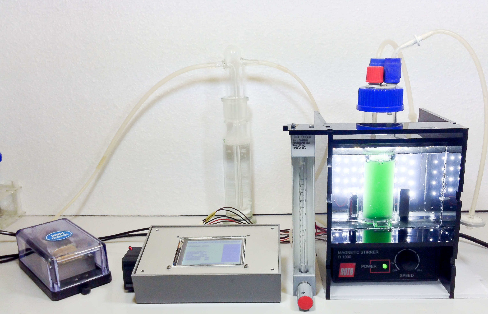

#NinjaPBR - The Photobioreactor for Cyanobacteria and Microalgae

NinjaPBR is an opensource (GPLv3) photobioreactor implementation to study the growth of cyanobacteria and microalgae in liquid cultures. It allows the online measurement of the number of cells under various environmental conditions.

The firmware for the Arduino-based controller is located in this repository. The corresponding laser cutting templates and controller board Fritzing schematics are also provided here. The python-based graphical user interface can be found [here](https://github.com/roblehmann/pyNinjaPBR).

Want to learn more? See the [wiki](https://github.com/roblehmann/NinjaPBR/wiki).

##Motivation
One application of the NinjaPBR is the understanding of how cyanobacteria tell time. Some cyanobacterial strains predict the natural procession of light and dark phases during each day with an internal molecular clock consisting of the KaiA, B and C proteins. This clock evolved to accommodate the day length on earth of approximately 24h and can adapt to varying relative lengths of light and dark (LD) phases. The NinjaPBR allows the simulation of different day lengths, light and dark phase lengths, and also light brightness profiles over the subjective day. The observation of growth rates under extreme LD rhythms could indicate the limits of adaptibility of the circadian clock mechanism.

The central measured variable, the number of cells in the liquid culture, is measured as usual by the attenuation of incident light on its path through the solution (optical density, OD). In short, NinjaPBR

*  is an open-source, cost-effective, easy to assemble cultivation system
*  allows precise turbidity measurement using infrared light
*  can be easily extended to measure other parameters, e.g., O2 and CO2 in the off-gas
*  allows cultivation in batch, fed-batch, and chemostat mode
*  allows easy changes in illumination spectra by varying LEDs
*  is prepared for optional measurement of additional wavelengths to assess physiological parameters, e.g. pigment content

The NinjaPBR is designed to use a single controller box to control multiple Sample Pods, each hosting a separate culture vessel within a water bath. Accordingly, each pod requires a full set of sensors for each parameter, an illumination light source, and gas supply.

*  Measure cell count via attenuation (OD, div. λ, calibration needed)
*  Temperature measured in water bath around vessel
*  Operation Modes: Batch, Fed Batch, Chemostat, (Turbidostat)
*  Compact – each Pod 205x140x150mm
*  Small sample volume < 120ml
*  Modular – 3 sample pods for 1 controller
*  Light programs for LED light source
*  Arduino-based controller for reactor management and data logging
*  Data transfer and control by computer GUI via USB

#Preliminary Experiments

###Batch Experiment with light/dark cycles
 The figure below shows the result of the following preliminary experiment:
 
*  Minimal reactor setup with Synechococcus sp. PCC 7002 in optimized media
*  Room temperature 24.5 °C, no temperature control
*  PFD 60 μmol m-2s-1
*  12/12h LD cycle using white LED light
*  Turbidity measured using 850nm wavelength
*  Reference measurement before experiment start with media-filled cuvette
*  sampling frequency Fsamp = 1/5 min-1

###Chemostat Experiment - Continuous dilution of culture with fresh media

*  Growth rate adjusts to dilution rate, yielding steady state in cell number
*  Experiment duration drastically extended up to months
*  Required extension of minimal setup:
	- Peristaltic pump attached to third reactor vessel port
	- Superfluous media due to dilution is removed via the off-gas vent via glass tube, which is placed at fixed height inside reactor vessel
* Experimental data with this setup are shown below
	-  Synechocystis sp. PCC 6803
	-  various LD rhythms
	-  Multiple wavelength OD measurement

---
#Inspiration

There are already a range of great bioreactor and photobioreactor designs out there, here is a small selection. In addition, there are several other great instruments on github, such as the [NinjaPCR](https://github.com/hisashin/NinjaPCR) open source Thermocycler or a [plate reader](https://github.com/csbl/platereader).

###Synechocystis Physiological Parameters
A small part pf the extensive [contribution](http://2015.igem.org/Team:Amsterdam/Project/Phy_param/Synechocysytis) of team Amsterdam to the international Genetically Engineered Machine Competition iGEM 2015 consisted of the extension of a commercial PBR allowing its operation as turbidostat. This project involved the University of Amsterdam, the Free University of Amsterdam, the Swammerdam Institute for Life Sciences (SILS), and several other institutions.

###Biomonstaaar
The photobioreactor design called Biomonstaaar was developed as a part of the  SpaceGAMBIT program. It is documented on [SpaceGAMBIT](http://www.spacegambit.org/biomonstaaar-open-source-bioreactor/) and on [Instructables](http://www.instructables.com/id/Biomonstaaar/). The concept is to build an array of three photobioreactors, each of which is controlled by an Arduino. The resulting data are collected in a Raspberry Pi and then uploaded into the cloud.

###Bertha
The Bertha bioreactor project of the École polytechnique fédérale de Lausanne (EPFL) employs many useful technologies, such as ZigBee Bluetooth modules for wireless data transfer. The code as well as physical designs are provided on [github](https://github.com/Bioreactor/Code-Bioreactor).

---
#Instructions

###Pod Construction

* Sample pod built from 5mm thick PMMA sheet material
* 2D templates for laser cutting are provided as EPS files in the templates sub-folder
	- Order cutting online from e.g. www.formulor.de, www.ponoko.com
	- Or manufacture yourself (maker lab / own laser cutter)
*  Minimal number of required bonding connections
*  Standard 10mm polystyrene cuvettes additionally required for light source / detector housing
*  Adhesive required for assembly
*  Check the [Wiki](https://github.com/roblehmann/NinjaPBR/wiki/Pod-Assembly) for more details and images

###Controller Based on Arduino

*  Arduino Mega + 3.2’’ touch screen with SD card slot
*  Breakout board for connection of periphery to Arduino provided as Fritzing sketch in the controller sub-folder
*  No expert knowledge in electronics required
*  Parts readily available 
*  Basic breakout board with 12V LED driver for all sample pods, and max. 2 emitter types on stripboard shown below
*  Controller puts out 12V for emitter, requiring separate driver ICs or current limiting resistors for each LED connection

###Measurement of Cell Density

*  Standard attenuation measurement, comparable to benchtop spectrophotometer
*  Through culture vessel, yielding 40mm optical path
*  850nm high power Led with constant current source for highly constant output
*  No lenses required
*  Calibration curve of extinction to cell number required
*  Extension prepared to use side-scattering to increase linear range and decrease dependency on cell morphology
*  [Wiki](https://github.com/roblehmann/NinjaPBR/wiki/Measuring-Cell-Number) for more

###Python GUI

*  Download and display data from controller
*  Online display when continuously connected
*  Data logging
*  Up- / download scripted light programs
*  Scheduled reactor mode change (planned experiment start)
*  Easy GUI customization using wxGlade
*  [The Repository](https://github.com/roblehmann/pyNinjaPBR)

---
#Contribute to NinjaPBR!

Im looking for people who are interested in helping develop the NinjaPBR or apply it.

---
#Author
[Robert Lehmann](https://github.com/roblehmann)

Check out [Celldeg.com](http://celldeg.com/) if you are interested in ultra-high density cultivation of cyanobacteria